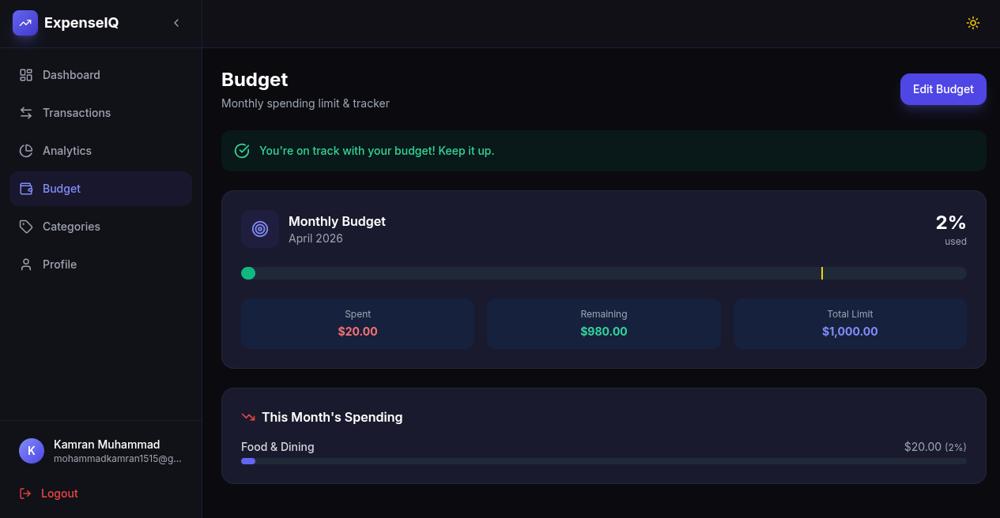
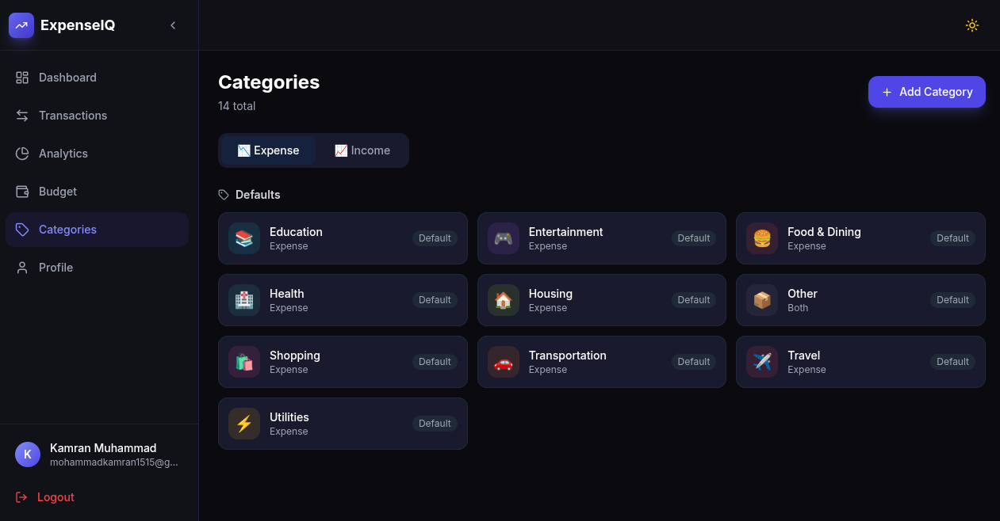
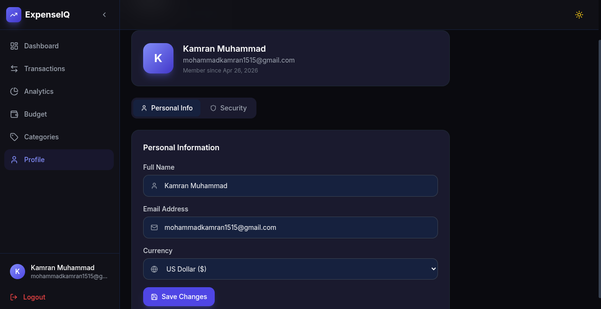

<div align="center">
  <h1>Expense-IQ 📈</h1>
  <p>A production-ready, fully responsive MERN stack web application for tracking income and expenses with real-time updates and dynamic charts.</p>
</div>

<br />

## 📸 Application Screenshots

Below are some previews of the core features and UI of Expense-IQ:

| Transactions Overview | Analytics & Trends |
| :---: | :---: |
|  |  |

| Budget Management | Categories Management |
| :---: | :---: |
|  |  |

<div align="center">
  <b>Profile Settings</b><br>
  
</div>

<br />

## 🚀 Features

- **Real-Time Updates:** Socket.io integration instantly syncs transactions across multiple devices without reloading.
- **Advanced Filtering & Analytics:** Filter data by specific months/years and visualize spending trends via interactive area, bar, and pie charts (using Recharts).
- **Global Currency Support:** Set your preferred currency (e.g. $, €, ¥, £) and formatting adapts seamlessly across the entire application.
- **Budgeting System:** Set monthly spending limits and receive visual alerts (progress bars) when approaching your defined thresholds.
- **Custom Categories:** Manage default and custom income/expense categories with custom icons and colors for granular tracking.
- **Authentication System:** Secure JWT-based registration and login utilizing HTTP-Only cookies and bcrypt hashing.
- **Modern & Responsive UI:** Built with React and Tailwind CSS, featuring a sleek, responsive layout, glassmorphism aesthetic, skeleton loaders, and smooth transitions.

## 🧱 Tech Stack

### Frontend
- **Framework:** React (Vite)
- **Styling:** Tailwind CSS
- **State Management:** Zustand
- **Charting:** Recharts
- **Routing:** React Router DOM
- **Forms & Validation:** React Hook Form + Zod
- **Real-time:** Socket.io-client

### Backend
- **Environment:** Node.js, Express.js
- **Database:** MongoDB + Mongoose
- **Authentication:** JSON Web Tokens (JWT) via HTTP-Only Cookies
- **Real-time:** Socket.io
- **Validation:** express-validator
- **Security:** Helmet, express-rate-limit, cors, cookie-parser

---

## 🛠️ Local Setup Instructions

Follow these steps to run the project locally on your machine.

### Prerequisites
- [Node.js](https://nodejs.org/en/) (v16 or higher)
- [MongoDB](https://www.mongodb.com/) running locally or a MongoDB Atlas connection string.
- Git

### 1. Clone the repository
```bash
git clone https://github.com/mohakamran/Expense-IQ.git
cd Expense-IQ
```

### 2. Install Dependencies

You will need to install dependencies for both the frontend and backend.

**Server Setup:**
```bash
cd server
npm install
```

**Client Setup:**
```bash
cd ../client
npm install
```

### 3. Environment Variables

Navigate to the `server/` directory and create a `.env` file (or duplicate the provided `.env.example`). Fill it with your local configuration:

```env
PORT=5000
MONGO_URI=mongodb://localhost:27017/expense-iq
JWT_SECRET=your_super_secret_jwt_key_here
JWT_EXPIRE=7d
CLIENT_URL=http://localhost:5173
NODE_ENV=development
```

### 4. Run the Application

You can run both servers concurrently. Open two separate terminal instances.

**Terminal 1 (Backend):**
```bash
cd server
npm run dev
```
*The API will be available at `http://localhost:5000`*

**Terminal 2 (Frontend):**
```bash
cd client
npm run dev
```
*The React app will be running at `http://localhost:5173`*

---

## 📁 Folder Structure

```text
Expense-IQ/
├── client/                 # Frontend React App (Vite)
│   ├── public/             # Static assets
│   └── src/
│       ├── components/     # Reusable UI cards, charts, layout
│       ├── hooks/          # Custom React hooks (Document title, socket connections)
│       ├── pages/          # Main application views (Dashboard, Analytics, etc.)
│       ├── store/          # Zustand state slices
│       ├── services/       # Axios API layer
│       └── utils/          # Helpers (formatters, CSV exports)
│
└── server/                 # Backend Node/Express App
    ├── config/             # MongoDB connection logic
    ├── controllers/        # Route controllers (Auth, Transactions)
    ├── middlewares/        # Authentication checks, error handlers
    ├── models/             # Mongoose schemas
    └── routes/             # Express API endpoints
```

## 🔒 Security Measures

- **HTTP-Only Cookies:** Auth tokens are securely stored in cookies to mitigate XSS (Cross-Site Scripting) vulnerabilities.
- **Rate Limiting:** Protects exposed API endpoints from brute-force and DDoS attacks.
- **Helmet Middleware:** Enforces secure HTTP headers.
- **Data Sanitization:** Strict input validation enforced via `express-validator` on the server and `zod` on the client.

---
